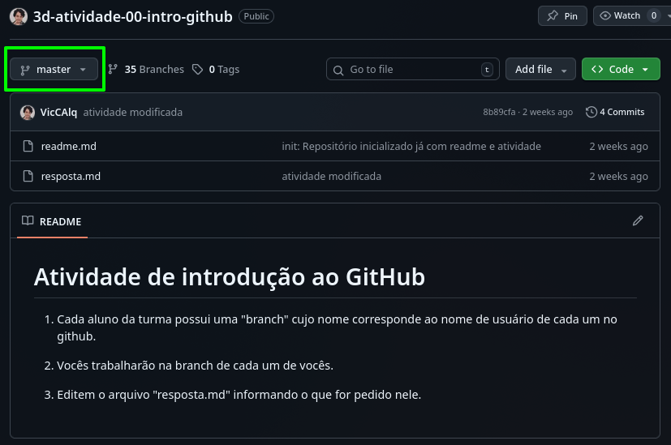
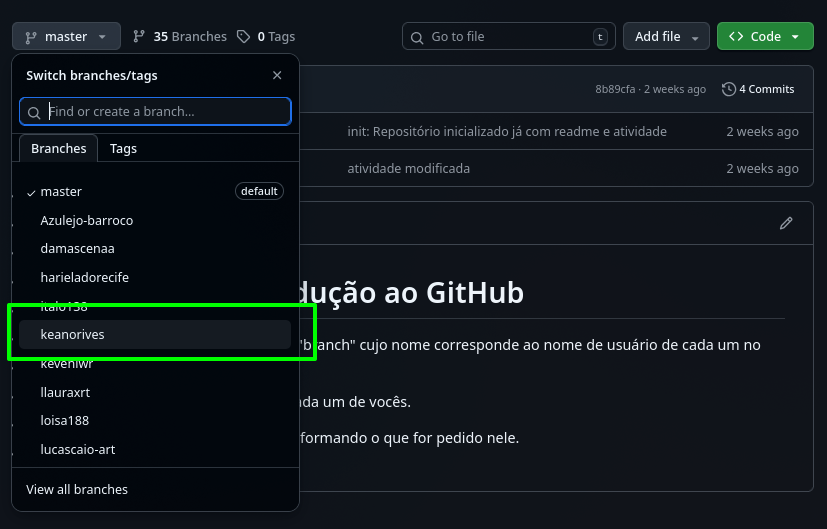
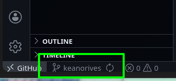
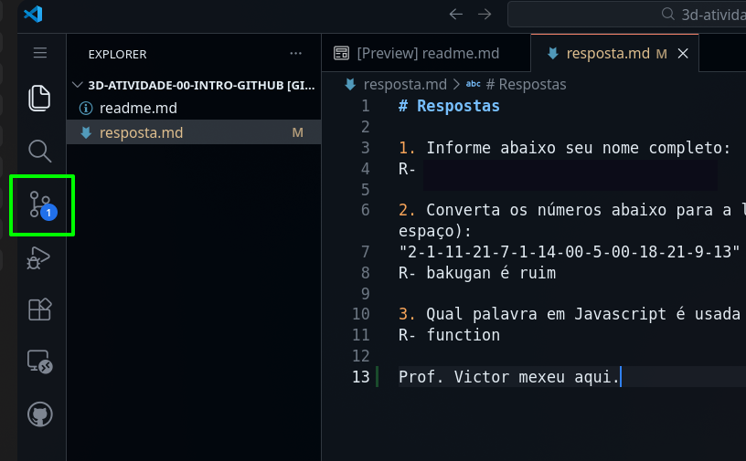
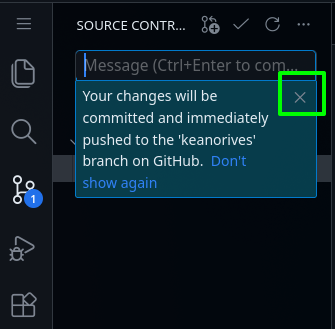
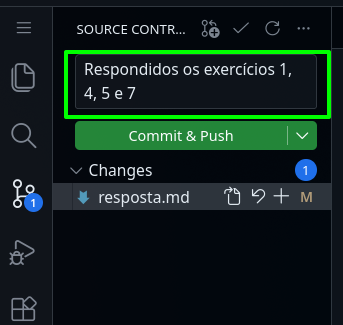
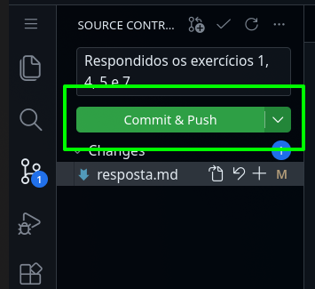

# Atividade de projeto

Sigam as instruções abaixo para a realização das atividades:

- [Arquivos para consulta](#arquivos-para-consulta)
- [Formato da atividade](#formato-da-atividade)
- [Para responder as atividades](#para-responder-as-atividades)
- [Instruções da atividade](#instruções-da-atividade)
- [Dicas](#dicas)

## Arquivos para consulta

A pasta `docs` contém arquivos no formato markdown (igual a este) para consulta, e eles estão divididos em tópicos.

## Formato da atividade

Bom dia gente, hoje começaremos a N2 no endereço abaixo:

https://github.com/VicCAlq/3x-t2-n2

A N2 será para as disciplinas Mobile e Backend. Vocês trabalharão com os grupos de PI (sem o pessoal de design). Cada grupo tem sua própria branch.

O projeto possui duas partes: Mobile e Backend:
- Mobile se encontra na pasta `frontend`
- Backend se encontra na pasta `backend`

Antes de desenvolver, instale as dependências com o comando `npm run install` de dentro da pasta raiz do projeto (onde as pastas `backend` e `frontend` se encontram).
Para executar o projeto abra dois terminais:
- Abra o frontend com o comando `npm run front` da mesma pasta da instrução anterior.
- Abra o backend com o comando `npm run back` da mesma pasta da instrução anterior.

O objetivo da N2 é desenvolver um agregador de notícias:

Sobre o backend:
- O backend deve criar um banco de dados com uma tabela para as notícias e outra para as fontes de notícias.
- Ele deve ter as rotas:
    - uma rota para cadastrar uma nova fonte de notícias
    - uma rota para filtrar notícias por fonte
    - uma rota para filtrar notícias por categoria
    - uma rota para apagar uma fonte de notícias
    - uma rota para apagar uma notícia

Sobre o frontend:
- Ele deve ter um campo para inserir uma nova fonte de notícias (formulário com campo de texto que recebe um link a ser preenchido)
- Ele deve ter uma tabela para exibir as notícias
- Ele deve ter dois menus no topo da tabela para filtrar as notícias por categoria ou por fonte

Os convites para as atividades serão enviados em breve, enquanto isso marquem esta atividade como entregue para registrar presença hoje.

## Para responder as atividades

1. Cada grupo possui uma "branch" cujo nome corresponde ao nome de usuário de cada grupo. Ao clicar no botão com o texto "master" acima da lista de arquivos deste projeto, aparece um menu onde você deve escolher a "branch" cujo nome é o mesmo que o nome de seu usuário no GitHub.  
  
  

2. Após selecionar sua branch, faça um dos dois passos abaixo (o resultado é o mesmo):
    - Aperte a tecla de ponto final no teclado, uma única vez
    ou
    - Se a opção acima não funcionar, no endereço da página onde tem "github.com" mude o ".com" para ".dev", e mantenha o restante do endereço da mesma forma.
    Ex: "github.com/viccalq/3c-01-variaveis" -> "github.dev/viccalq/3c-01-variaveis"

3. Espere o VSCode online carregar por completo antes de mexer no projeto. Demora um pouco.

4. Confirme se na parte de baixo a esquerda no VSCode online o nome da branch é o mesmo que o nome de seu usuário. Se não for, clique no nome que aparece na branch, e no menu que aparecer selecione a sua branch.  
  

5. As instruções para as atividades se encontram na próxima sessão (Formato dos exercícios). Quando terminar, volte para o passo 6 desta sessão.

6. Para salvar as modificações e enviar a atividade, clique no terceiro botão dos ícones na borda esquerda do VSCode para abrir um outro menu.  
  

7. Feche a mensagem que aparece sobre o commit.  
  

8. Escreva uma mensagem informando quais exercícios você respondeu da lista. Exemplo: "Respondidos os exercícios 1, 4, 5 e 7".  
  

9. Clique no botão "Commit & push" e espere um pouco. Após o botão ficar desabilitado, a atividade foi enviada.  
  

